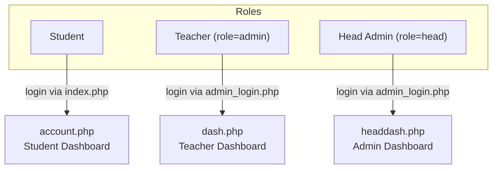
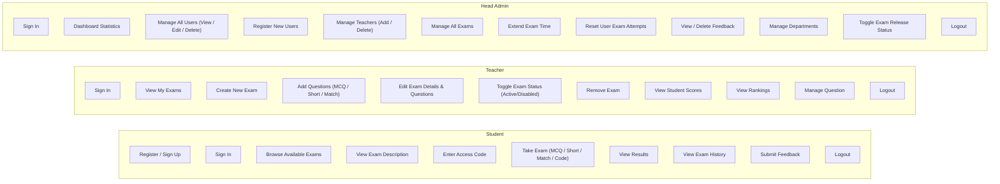
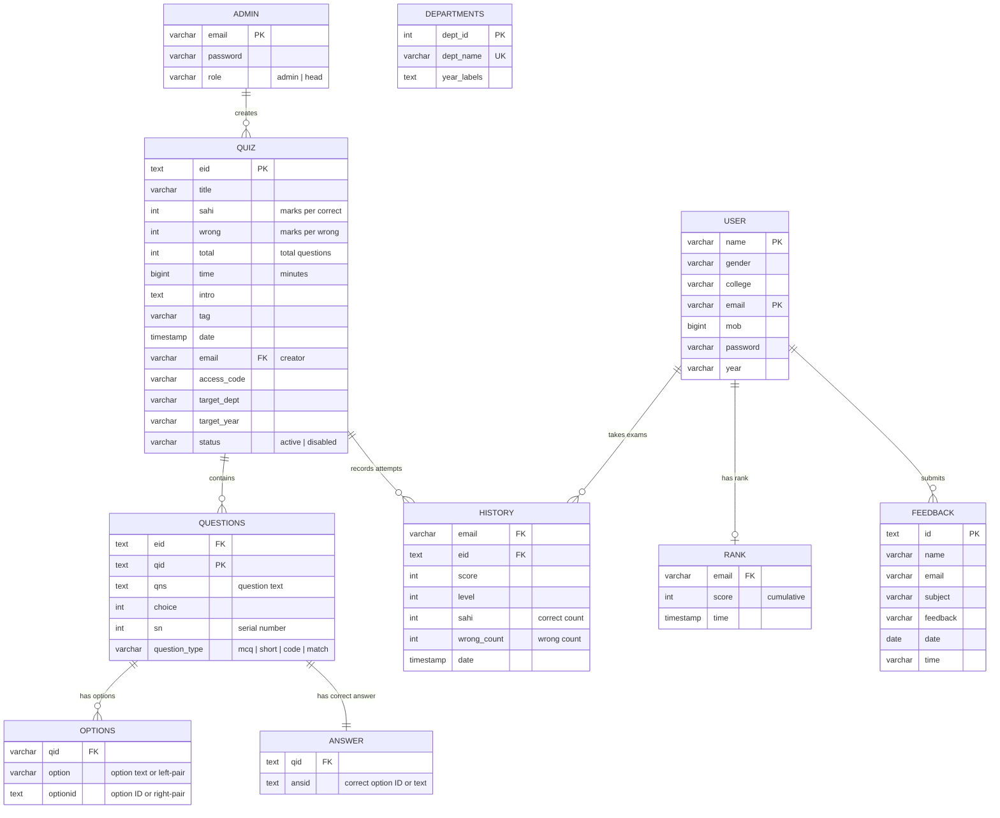
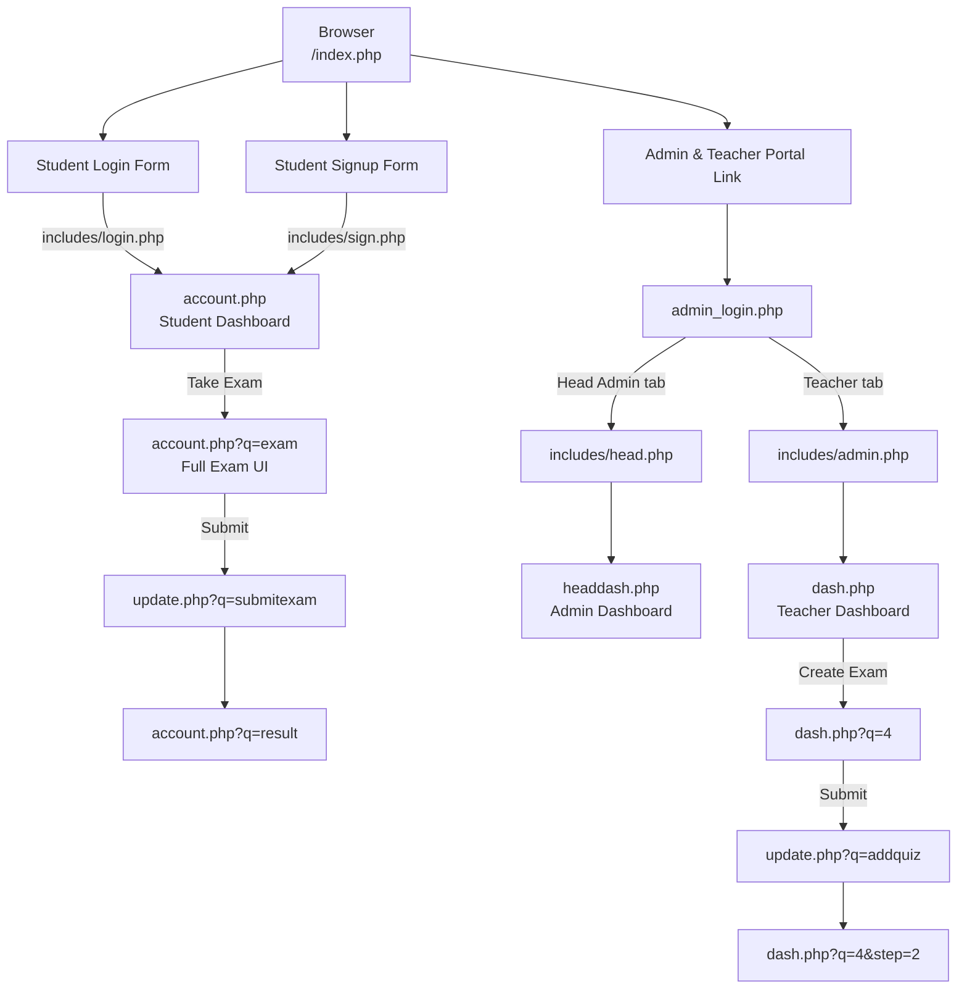

# ECUSTA Online Exam System — System Overview

> **ECUSTA** = Ethiopian Catholic University St. Thomas Aquinas

## 1. Purpose

ECUSTA is a web-based **Online Examination System** that enables:

- **Students** to register, browse available exams, take timed exams (MCQ, short answer, matching, code), and review results.
- **Teachers** to create and manage exams, view student scores, and monitor rankings.
- **Head Admins** to manage users, teachers, departments, feedback, and oversee all exams system-wide.

---

## 2. Technology Stack

| Layer      | Technology              |
| ---------- | ----------------------- |
| Backend    | **PHP 7+** (procedural) |
| Database   | **MariaDB / MySQL**     |
| Web Server | **XAMPP (Apache)**      |
| Frontend   | **HTML5, CSS3, JS**     |
| Fonts      | Google Fonts (Inter)    |
| Icons      | Material Icons          |
| Theming    | Custom CSS variables    |
V
---

## 3. User Roles



| Role       | DB Table | Login Handler       | Dashboard      |
| ---------- | -------- | ------------------- | -------------- |
| Student    | `user`   | `includes/login.php`  | `account.php`  |
| Teacher    | `admin` (role=`admin`) | `includes/admin.php`  | `dash.php`     |
| Head Admin | `admin` (role=`head`)  | `includes/head.php`   | `headdash.php` |

---

## 4. Use Case Diagram



---

## 5. Database Schema (ER Diagram)



---

## 6. File Structure Overview

```
Online-exam-system/
├── index.php              # Student login & registration page
├── admin_login.php        # Admin (Head) & Teacher login page
├── account.php            # Student dashboard (exams, taking, results, history)
├── dash.php               # Teacher dashboard (CRUD exams, scores, rankings)
├── headdash.php           # Head Admin dashboard (users, teachers, depts, exams)
├── update.php             # Central action handler (all POST/GET operations)
├── logout.php             # Session destroy & redirect
│
├── config/
│   └── dbConnection.php   # MySQL connection ($con)
│
├── includes/
│   ├── login.php          # Student login logic
│   ├── sign.php           # Student registration logic
│   ├── admin.php          # Teacher login logic
│   ├── head.php           # Head Admin login logic
│   ├── signadmin.php      # Teacher registration logic (admin use)
│   └── feed.php           # Feedback submission handler
│
├── database/
│   ├── project1.sql       # Full database schema + seed data
│   ├── patch_schema.php   # Schema migration v1
│   ├── patch_schema_v2.php
│   ├── patch_schema_v3.php
│   └── patch_schema_v4.php
│
├── css/
│   └── theme.css          # Global CSS variables & theming (dark/light mode)
│
├── js/
│   └── theme.js           # Theme toggle JavaScript
│
├── assets/                # Images (logo, etc.)
└── fonts/                 # Custom fonts
```

---

## 7. Navigation Flow Summary


