# ECUSTA — Sequence Diagrams & Interaction Flows

This document contains **sequence diagrams** for all major user interactions in the system.

---

## 1. Student Registration Flow

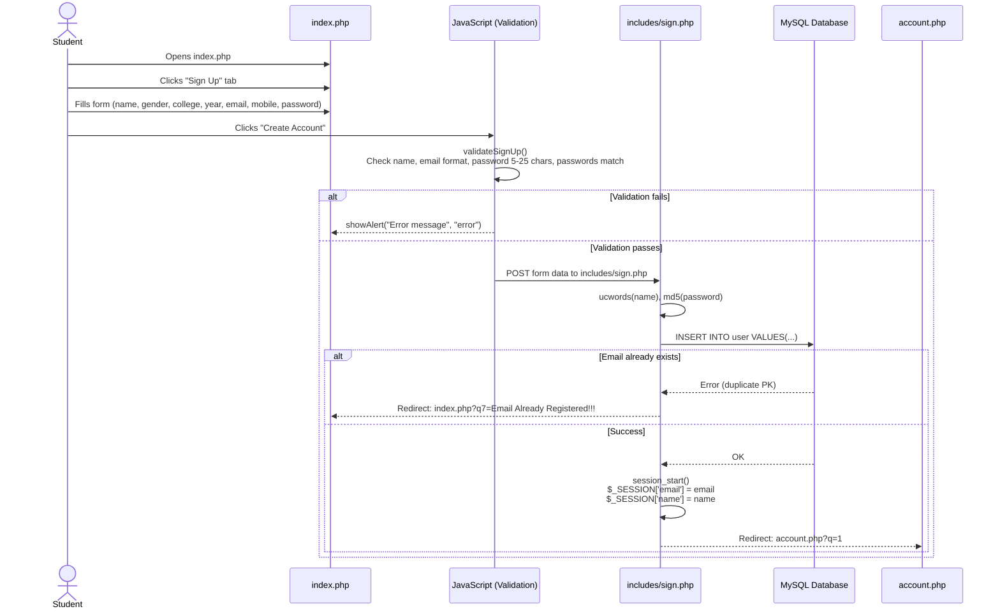

---

## 2. Student Login Flow

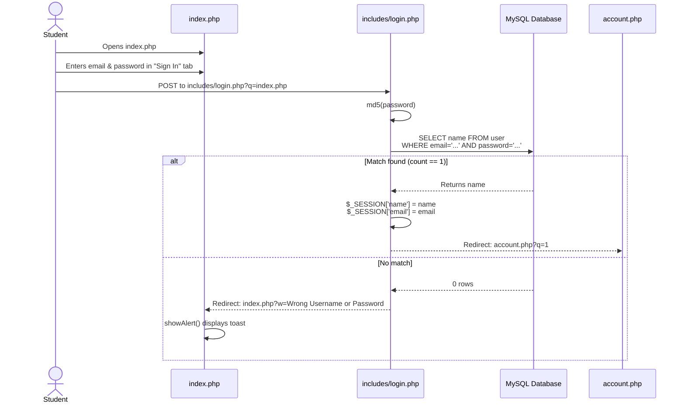

---

## 3. Admin / Teacher Login Flow

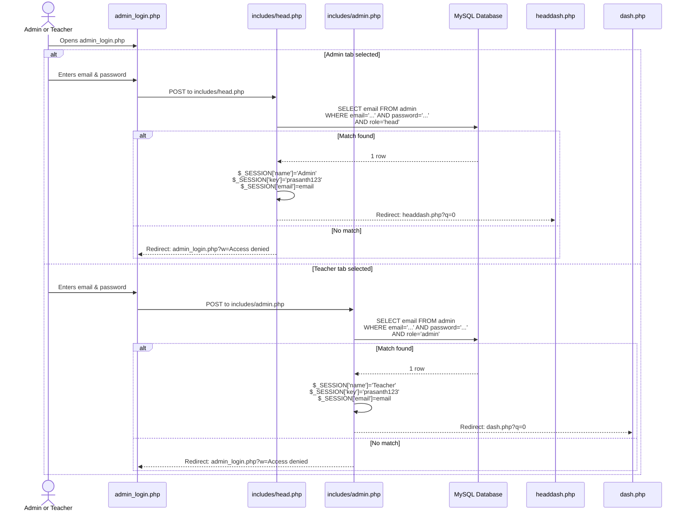

---

## 4. Exam Creation Flow (Teacher / Admin)

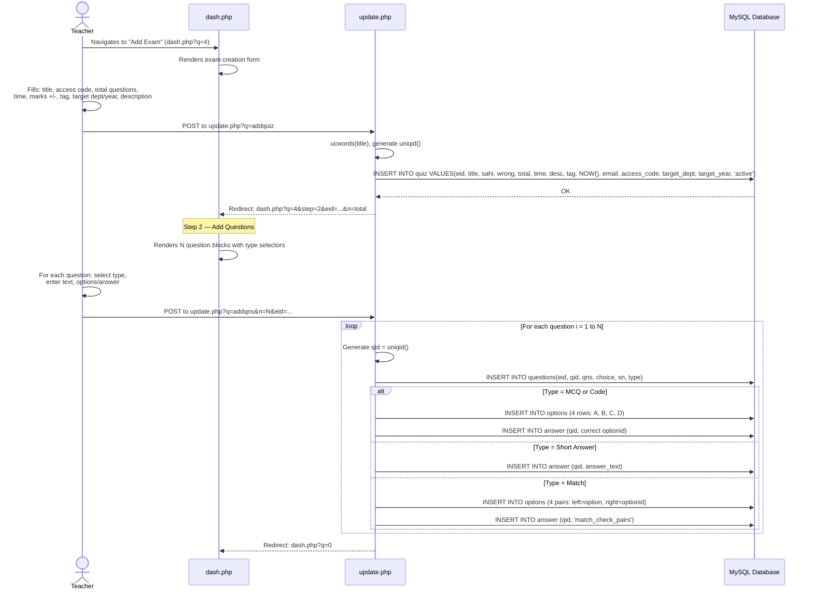

---

## 5. Student Takes Exam Flow (Full Lifecycle)

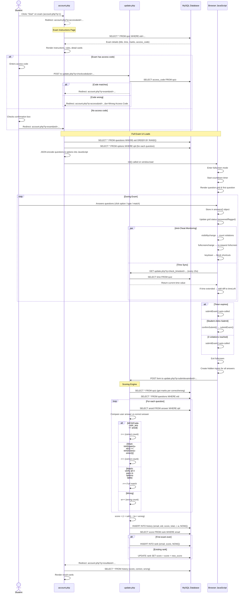

---

## 6. Admin Manages Users Flow

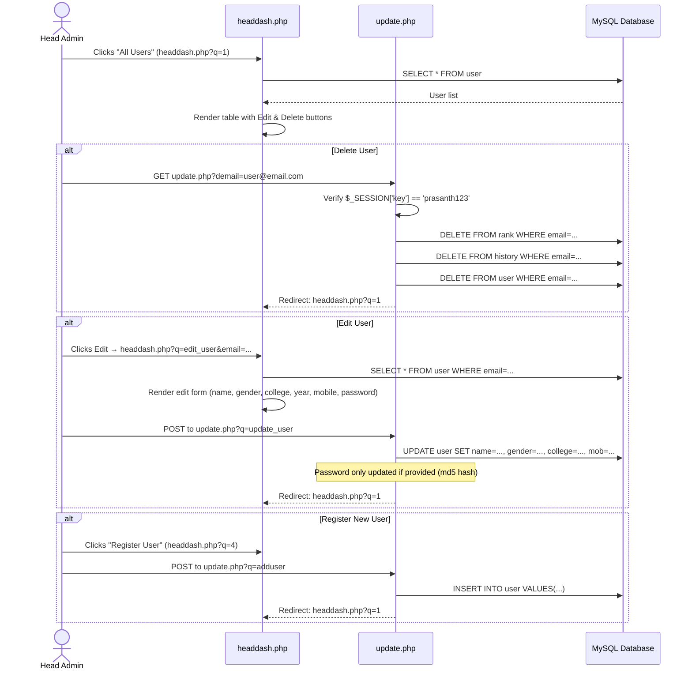

---

## 7. Exam Management Flow (Admin)

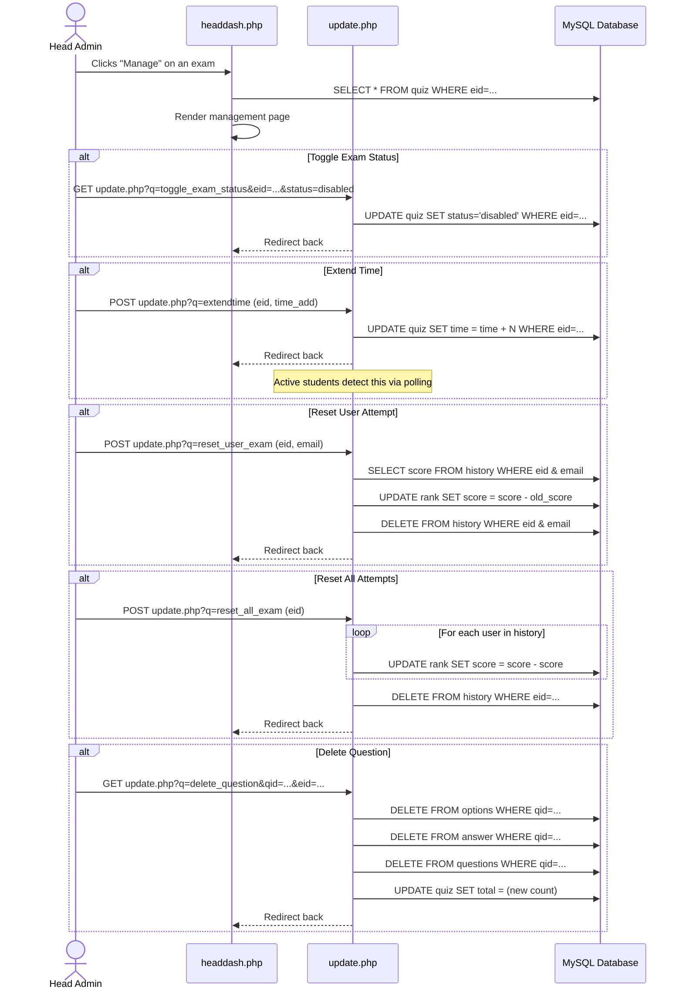

---

## 8. Department Management Flow

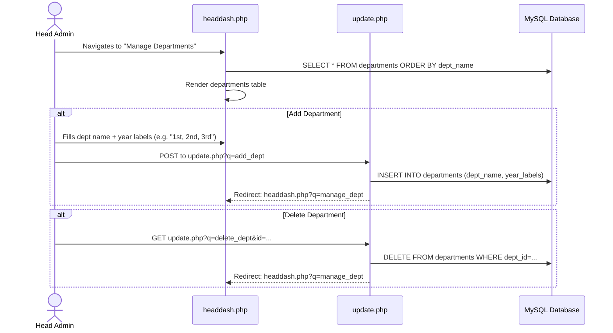

---

## 9. Feedback Flow

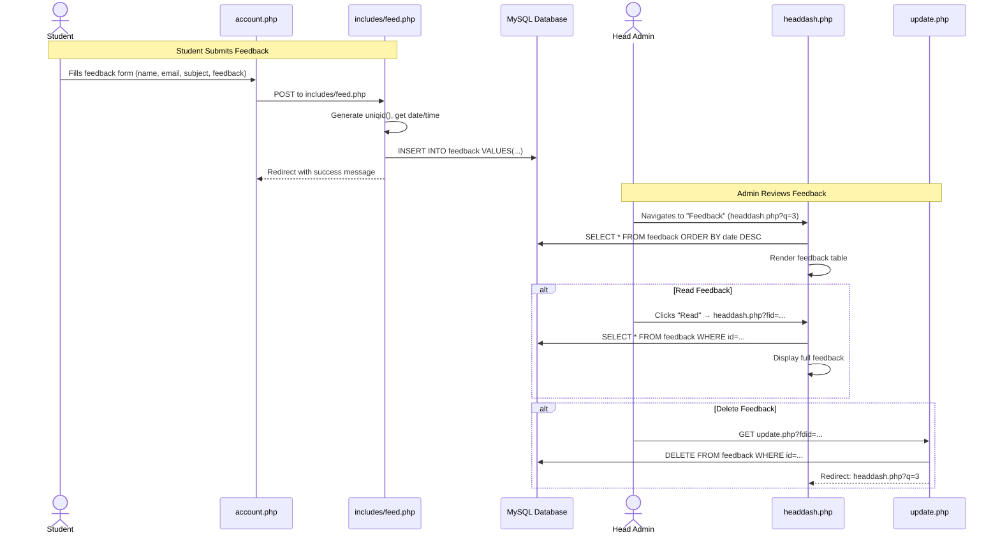

---

## 10. Logout Flow

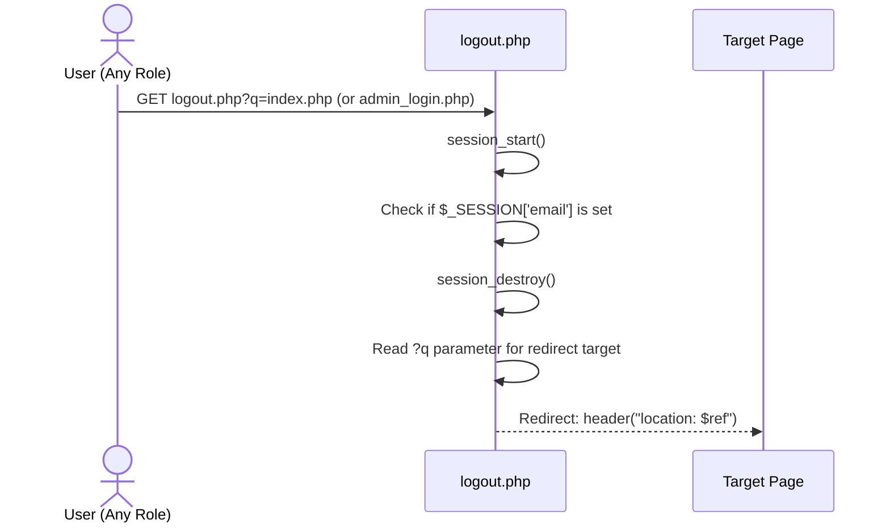

---

## Activity Diagram — Complete Exam Lifecycle

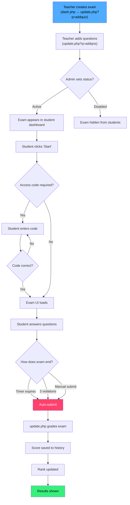
